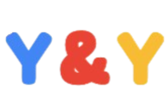

# 🧸 Yap & Yap: Your Toy Story AI Advice Adventure! 🚀

<div align="center">
  
  <br>
  <em>"To Infinity and Beyond... with Advice!"</em>
</div>

## 🌟 Welcome to Andy's Room!

Howdy partner! Welcome to **Yap & Yap**, the interactive advice platform where your favorite Toy Story characters come to life and offer their unique perspectives on your burning questions. Whether you need the loyal wisdom of Woody, the space-age perspective of Buzz Lightyear, or even the brutally honest takes from Mr. Potato Head, we've got a toy for every situation!

## ✨ Features That'll Make You Say "Reach for the Sky!"

- 🤠 **Character Selection**: Choose from 9 iconic Toy Story characters, each with their unique personalities and advice styles
- 🚀 **Real-Time AI Responses**: Powered by Google's Gemini AI for character-authentic answers
- 🌙 **Dark/Light Mode**: Switch between Andy's room by day or night
- 💬 **Interactive Conversations**: Have follow-up chats with individual characters
- ☁️ **Cloud Wallpaper**: Authentic Andy's room cloud background throughout the app
- 🪄 **Pixar Lamp Animation**: Watch our iconic jumping lamp animation on the landing page!
- 🏆 **End-of-Chat Celebration**: Get your official "Yapster Certificate" when you're done

## 🧩 Meet Your Toy Advisors

- **Woody** 🤠 - The loyal sheriff who gives thoughtful, morally sound advice
- **Buzz Lightyear** 🚀 - Overconfident space ranger with heroic but impractical suggestions
- **Rex** 🦖 - Anxious dinosaur who fears the worst-case scenario
- **Mr. Potato Head** 🥔 - Brutally honest with zero filter
- **Slinky Dog** 🐶 - The yes-man who enthusiastically supports any idea
- **Lotso** 🧸 - Sweet-talking bear with manipulative tendencies
- **Jessie** 🤠 - Wildly emotional cowgirl with impulsive, feeling-based advice
- **Bo Peep** 🐑 - Independent strategist with wise, thoughtful solutions
- **Hamm** 🐷 - Coldly logical piggy bank focused on practical benefits and costs

## 🛠️ Technical Toy Box

### Built With

- **React 19** - Latest UI library for building interactive components
- **Vite** - Lightning-fast frontend build tool
- **TailwindCSS** - For responsive styling with Andy's room aesthetics
- **Google Gemini API** - Powers our toy characters with AI personality
- **Custom Animations** - Pixar-inspired lamp and cloud effects

### Project Structure

```
src/
├── api/               # Gemini API integration
├── assets/            # Images, including character avatars
│   └── avatars/       # Individual toy character images
├── components/        # React components for each screen
├── data/              # Character definitions and personalities
└── styles/            # Theme and font styling
```

## 🚀 Getting Started (To Infinity and Beyond!)

### Prerequisites

- Node.js 16+
- A Google Gemini API key

### Installation

1. Clone this toy chest:
   ```bash
   git clone https://github.com/your-username/yap-and-yap.git
   cd yap-and-yap
   ```

2. Install the playthings:
   ```bash
   npm install
   ```

3. Create a `.env` file in the project root:
   ```
   VITE_GEMINI_API_KEY=your_api_key_here
   ```

4. Launch to infinity (and beyond):
   ```bash
   npm run dev
   ```

5. Open [http://localhost:5173](http://localhost:5173) to see the toys in action!

## 🎮 How to Play

1. **Ask a Question**: Type your burning question on the landing page
2. **Choose Characters**: Click the "Choose Characters" button to select which toys will answer
3. **Get Responses**: Each character will provide their unique perspective
4. **Chat More**: Click on a character to start a one-on-one conversation
5. **Follow Up**: Ask follow-up questions to all characters
6. **End Chat**: When satisfied, click "End Yap" to get your certificate

## 🌈 Character Color Themes

Each toy has their own color palette that changes with light/dark mode:

- **Woody**: Brown/Tan cowboy-inspired theme
- **Buzz**: Space blue for infinity and beyond
- **Rex**: Anxious green dinosaur colors
- **Mr. Potato Head**: Earthy potato browns
- **Slinky Dog**: Friendly golden hues
- **Lotso**: Deceptively sweet pink tones
- **Jessie**: Energetic red cowgirl theme
- **Bo Peep**: Soft lavender shepherd tones
- **Hamm**: Practical piggy bank silver/gray

## 🔍 Behind the Scenes

Each character uses a specially crafted prompt template to ensure their personality shines through in their responses. For example, Rex will always catastrophize, while Woody gives genuinely helpful advice. The Gemini AI model is fine-tuned to keep responses concise (under 30 words) and in character.

## 📝 License

This project is licensed under the MIT License - see the LICENSE file for details.

## 🙌 Acknowledgments

- Pixar's Toy Story for the character inspiration
- Google's Gemini AI for powering our toy personalities
- The GDSC Guelph Hackathon team for bringing these toys to life

<div align="center">
  <br>
  <em>"You've got a friend in Yap & Yap!"</em>
</div>
